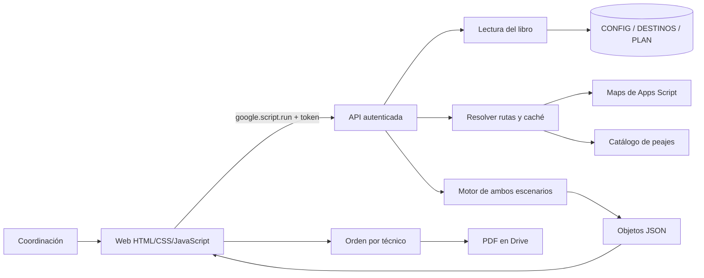

# Arquitectura y mantenimiento · v2.1

Guía técnica complementaria al [README](../../README.md). La v2 usa Apps Script sin compilación ni dependencias npm en producción.

## Flujo de datos



El navegador no consulta directamente Sheets ni almacena la clave configurada. `google.script.run` es asíncrono. Una respuesta del servidor debe tener tipos serializables; los `Date` se convierten a ISO y los valores infinitos se representan como «no ejecutable». [Referencia oficial](https://developers.google.com/apps-script/guides/html/communication).

## Archivos y responsabilidades

| Archivo en `apps-script/` | Responsabilidad |
| --- | --- |
| `00_Esquema.gs` | Parámetros, tablas, escenarios y funciones comunes de tiempo en sitio |
| `01_Peajes.gs` | Catálogo local, secuencias y cálculos de plazas |
| `02_Setup.gs` | Instalación, siembra de 16 destinos más base y 23 tramos; bitácora |
| `03_Maps.gs` | Consulta de rutas, caché y comparación de autopista/desvío |
| `04_Motor.gs` | Cálculo de tramos, jornadas, técnico-días, transferencias, costos y alertas |
| `05_Datos.gs` | Traducción de hojas y rangos con nombre a objetos |
| `06_Api.gs` | Login, sesión, tablero, simulador, orden y configuración |
| `07_WebApp.gs` | Entrada web, menús, exportación PDF y diagnóstico en Google |
| `08_Editor.gs` | Edición validada de destinos y plan; bloqueo y detección de conflicto |
| `09_ConexionMaps.gs` | Proveedor nativo o Routes API, diagnóstico y actualización por lotes |
| `10_Agenda.gs` | Órdenes nuevas, comparación humana de transporte, bloques de calendario y estados |
| `Index.html` | Estructura de diez pantallas y campos |
| `Estilos.html` | Estilos, tablas desplazables, disposición móvil e impresión |
| `Scripts.html` | Login, navegación, tablas, gráficos, órdenes y simulación |
| `Editor.html` | Formularios, itinerario, flota, CSV y gráficos básicos sin Google Charts |
| `appsscript.json` | Runtime V8, zona horaria y configuración web |

No combinar estos archivos con v1: repetir nombres globales como `doGet` o `onOpen` puede cambiar el comportamiento del proyecto.

## Modelo de almacenamiento

| Hoja | Contenido |
| --- | --- |
| CONFIG | Parámetros mediante rangos `P_*`, técnicos, flota, tarifas, checklist, feriados y ajustes |
| DESTINOS | Localidad, región, dirección, RM, equipos, hotel, enlace de capacitación, corredor, plazas y columnas calculadas |
| PLAN | N, día, cuadrilla, modo, vehículo, origen, destino, noches, conductor y checkbox por código de técnico |
| _RUTAS | Caché de respuestas origen-destino con/sin peajes |
| _BITACORA | Ingresos, recálculos, cambios y generación de documentos |

CONFIG usa rangos con nombre. DESTINOS y PLAN tienen título en fila 1, encabezados en fila 2 y datos desde fila 3. No renombrar las localidades ni los códigos sin actualizar referencias.

Las asignaciones se leen por **encabezado de código de técnico**, evitando desplazar personas al desactivar a alguien. Si un técnico inactivo sigue marcado, se informa un error. Para mantener nómina y flota, editar las tablas maestras de CONFIG; esos catálogos no tienen un CRUD individual en la web.

## API pública

Todas las funciones siguientes, salvo iniciar/cerrar sesión, exigen token válido. Las funciones internas terminan en `_`; Apps Script no permite llamarlas mediante `google.script.run`. Esa restricción es parte del control de acceso, no solo estilo de nombres.

| Función | Entrada principal | Resultado/efecto |
| --- | --- | --- |
| `iniciarSesion` | Correo y clave | Valida hash, crea token en caché |
| `cerrarSesion` | Token | Elimina la sesión |
| `obtenerTablero` | Token, escenario, forzar | Devuelve datos del panel; aprovecha caché |
| `recalcular` | Token, escenario | Invalida tablero y vuelve a calcular |
| `actualizarRutas` | Token | Invalida rutas, consulta Maps y escribe calculados |
| `simularTrabajo` | Token, localidad/equipos/técnicos/día/escenario | Estimación independiente, sin crear filas de PLAN |
| `obtenerOrdenServicio` | Token, técnico, escenario | Orden coherente con el escenario elegido |
| `exportarOrdenDesdeApi` | Token, técnico, escenario | Crea PDF en Drive y devuelve enlace |
| `obtenerCatalogoPeajes` | Token | Plazas y secuencias |
| `obtenerEsquemaConfig` | Token | Definiciones para generar el formulario |
| `guardarParametro` | Token, clave, valor | Valida y guarda un parámetro permitido |
| `obtenerEditor` | Token | Borrador de destinos/plan, parámetros y revisiones |
| `guardarDestino` | Token, revisión y campos | Guarda dirección/hotel/enlace; conserva equipos |
| `guardarPlanWeb` | Token, revisión y filas | Guarda filas de planificación validadas |
| `obtenerAgenda` | Token | Lee órdenes nuevas de `AGENDA` |
| `previsualizarOrden` | Token y formulario | Consulta ida/regreso y compara camioneta, bus, avión y transporte público |
| `guardarOrdenAgenda` | Token, previa y modo elegido | Guarda solo la alternativa seleccionada después de validar conflictos |
| `cambiarEstadoAgenda` | Token, ID, revisión y estado | Actualiza estado administrativo con transición controlada |
| `diagnosticarMaps` / `actualizarMapsWeb` | Token | Prueba una ruta o procesa un lote limitado de rutas |

`doGet` sirve la página y `onOpen` construye el menú de Sheets. Las funciones administrativas de instalación, lectura y PDF directo son privadas. Para configurar un libro se ejecuta `configurarAcceso_` desde el editor; no desde una petición web.

Los parámetros `?vista=orden&tecnico=T01` se insertan en atributos HTML escapados de Index. Scripts los lee desde `document.body.dataset`. Los fragmentos incluidos no intentan evaluar una segunda vez expresiones de plantilla.

## Qué sucede al recalcular

1. `leerDatosDelLibro_` lee parámetros, técnicos activos, flota, tarifas, destinos y plan.
2. El plan se ordena por día, cuadrilla y número de tramo.
3. `resolverRutas_` resuelve los pares necesarios y las rutas desde base para comparar transporte.
4. `calcularPlan_` aplica el escenario a una copia de parámetros.
5. `calcularTramos_` calcula viaje, primera visita, servicio y costos.
6. `agruparJornadas_` suma carga por cuadrilla/día y calcula sobretiempo.
7. `calcularTecnicoDias_` evita viáticos duplicados cuando hay varios tramos diarios.
8. Se imputan localidades, transferencias, resumen técnico, totales y alertas.
9. Se repite el cálculo con el escenario alternativo y se comparan resultados.
10. La API serializa el resultado; el navegador dibuja las pantallas.

El cálculo es una evaluación, no confirmación de ejecución. La primera consulta puede tardar más por Maps. Recalcular ignora la caché de tablero pero puede usar rutas aún vigentes. Cambiar un destino invalida rutas y exige recalcular para actualizar el presupuesto.

## Escritura, validaciones y concurrencia

Los parámetros calculados o identificados como PDF están bloqueados en la web y en servidor. Se comprueban tipos, enteros, rangos, listas y fechas antes de escribir. Los textos del editor rechazan fórmulas y los enlaces de capacitación deben comenzar por HTTPS.

Destinos conserva la cantidad de equipos del caso; modifica dirección, hotel y material. PLAN valida:

- Entre 1 y 200 filas, números de tramo enteros y únicos.
- Días dentro del horizonte, localidades existentes y cuadrilla no vacía.
- Modo camioneta, vehículo disponible y técnico activo.
- Conductor presente en el tramo y con licencia.
- Ausencia de doble asignación de vehículo o técnico en distintas cuadrillas el mismo día.
- Cadena continua de origen/destino y regreso final a BASE.
- Cero o una noche por tramo; una pernocta debe ser el último tramo de ese día.

Las alertas de duración se calculan después de guardar y recalcular. **Guardar un borrador no equivale a aprobar la salida.** El motor puede señalar destinos pendientes u horas excesivas.

La revisión es un hash de las filas leídas. Dentro de `LockService` se vuelve a leer y comparar; si otra sesión guardó, se rechaza la revisión antigua. Las ediciones directas en Sheets no participan del bloqueo. El guardado de un parámetro es individual, sin revisión optimista de todo CONFIG.

## Costos y límites heredados

El motor compara bus/avión, pero el editor operativo solo permite camionetas. Las tarifas alternativas no representan conexiones verificadas, horarios, equipaje ni disponibilidad comercial. Pasajes multimodales y su financiación personal requieren ampliar el modelo antes de operar.

El contador de extra llamado semanal acumula el período completo. La holgura del calendario es teórica, no disponibilidad confirmada en una localidad: no modela la posición exacta a una hora determinada. La simulación desde base no reserva personas.

El modelo de respaldo por corredor puede ser impreciso. Ante ausencia de km/tiempo válido debe corregirse la fuente antes de aceptar el costo. La lista de plazas no garantiza que coincida con el recorrido real usado por Maps.

## Pruebas y vista previa

```powershell
# Desde CRM
node v2/tests/web.cjs
node v2/tests/interfaz.cjs
node v2/tests/preview.cjs
```

`fixture.cjs` carga los mismos `.gs` en un contexto Node y proporciona rutas **sintéticas**. `web.cjs` prueba motor y contratos; `interfaz.cjs` evalúa el JavaScript de HTML con DOM/RPC simulados. `preview.cjs` sirve una web de lectura local; no ejecuta los guardados ni exporta a Drive.

La vista previa incluye un aviso visible de datos sintéticos. Los importes de esas pruebas no se publican como precios reales. Las pruebas no validan OAuth, cuotas, conversión PDF de Google ni comportamiento visual de un navegador real.

En esta revisión la política bloqueó abrir Edge y la conexión de clasp falló por proxy rechazado. La integración debe validarse en Google con la lista de [pendientes](../../docs/PENDIENTES.md).

## Cambios de esta revisión

- Diez pantallas con edición, itinerario, flota, CSV y guía de exposición.
- Escenario literal por defecto y mejora identificada como propuesta.
- Orden/PDF/simulación reciben el escenario seleccionado.
- Serialización completa del tablero, incluida la fecha de operación.
- Lectura de técnicos por encabezado y rechazo de inactivos asignados.
- Funciones internas privadas y eliminación de clave fija en código.
- Bloqueo, validación y detección de conflicto al editar desde web.
- Calendario con suma correcta de holgura y límites consistentes.
- Gráficos básicos para conservar información si Google Charts no carga.
- Documentación principal unificada y guion para cuatro integrantes.
